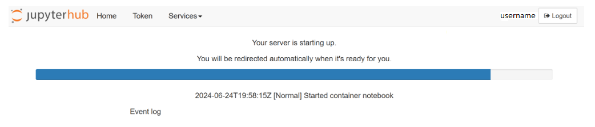
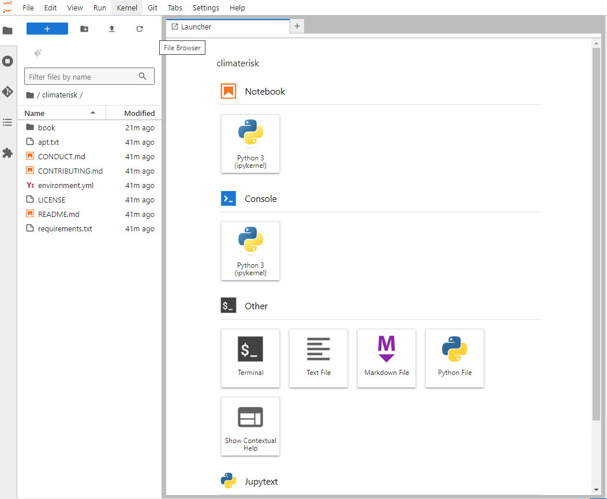
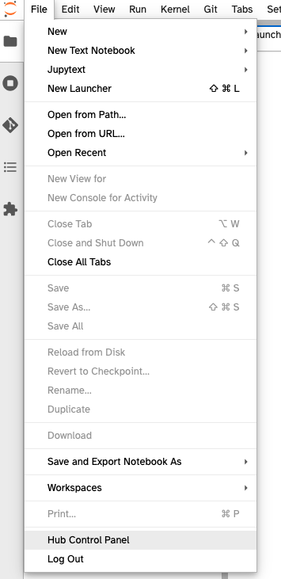

---
jupyter:
  jupytext:
    text_representation:
      extension: .md
      format_name: markdown
      format_version: '1.3'
      jupytext_version: 1.17.1
  kernelspec:
    display_name: Python 3 (ipykernel)
    language: python
    name: python3
---

# Using the 2i2c Hub

<!-- #region jupyter={"source_hidden": true} -->
This notebook lays out instructions to log into the cloud infrastructure ([JupyterHub](https://jupyter.org/hub)) provided by [2i2c](https://2i2c.org) for this tutorial.

**You won't be able to complete this step until the actual day of the tutorial (you'll get the password then).**
<!-- #endregion -->

## Logging into the 2i2c Hub

<!-- #region jupyter={"source_hidden": true} -->
To login to the JupyterHub provided by 2i2c, follow these steps:
<!-- #endregion -->

<!-- #region jupyter={"source_hidden": true} -->
1. **Navigate to the 2i2c Hub:** Point your web browser to [this link](https://climaterisk.opensci.2i2c.cloud).

2. **Log in with your Credentials:**

  + **Username:** Feel free to choose any username you like.  We suggest using your GitHub username to avoid conflicts.
  + **Password:** *You'll receive the password on the day of the tutorial*.

3. **Logging In:**

The login process might take a few minutes, especially if a new virtual workspace needs to be created just for you. 
<!-- #endregion -->

<!-- #region jupyter={"source_hidden": true} -->

<!-- #endregion -->

### What to Expect:

<!-- #region jupyter={"source_hidden": true} -->
By default,  logging into [`https://climaterisk.opensci.2i2c.cloud`](https://climaterisk.opensci.2i2c.cloud) automatically clones a repository to work in. If the login is successful, you will see the following screen and are ready to start working. 

 

**Notes:** Any files you work on will persist between sessions as long as you use the same username when logging in.
<!-- #endregion -->

<!-- #region jupyter={"source_hidden": false} -->
---
<!-- #endregion -->

## Shutting Down the 2i2c Hub

<!-- #region jupyter={"source_hidden": true} -->
To shut down the JupyterHub provided by 2i2c, follow these steps:

+ Save and shut down all Jupyter notebooks (the *Sessions and Tabs* can shut down all kernels at once).
+ From the *File* menu, select *Hub Control Panel* (located near the bottom of the menu). &nbsp;
+ When the hub control panel loads in a new browser tab, click the red button.&nbsp; 
<!-- #endregion -->

<!-- #region jupyter={"source_hidden": false} -->
---
<!-- #endregion -->
