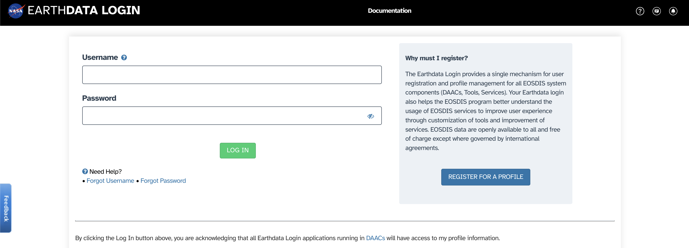

---
jupyter:
  jupytext:
    text_representation:
      extension: .md
      format_name: markdown
      format_version: '1.3'
      jupytext_version: 1.17.1
  kernelspec:
    display_name: Python 3 (ipykernel)
    language: python
    name: python3
---

# Getting NASA Earthdata Credentials

<!-- #region jupyter={"source_hidden": true} -->
This notebook lays out the process to obtain for NASA Earthdata credentials.

**You can complete this step before the day of the actual tutorial.**
<!-- #endregion -->

<!-- #region jupyter={"source_hidden": false} -->
---
<!-- #endregion -->

## Brief Introduction

<!-- #region jupyter={"source_hidden": true} -->
The [NASA Earth Science Data Systems (ESDS)](https://www.earthdata.nasa.gov/) program oversees the lifecycle of Earth science data from all its Earth observation missions, from acquisition to processing and distribution.

For the purposes of this guide, the NASA Earthdata website is the entry point that allows full, free & open access to NASA's Earth science data collections, in order to accelerate scientific progress for the benefit of society. To access the data through this portal, users must first define their access credentials.
<!-- #endregion -->

<!-- #region jupyter={"source_hidden": false} -->
---
<!-- #endregion -->

## Creating NASA Earthdata Credentials

<!-- #region jupyter={"source_hidden": true} -->
If you have previously registered NASA Earthdata credentials *proceed to the next notebook* (i.e., you do not need to register a new NASA Earthdata profile).
<!-- #endregion -->

<!-- #region jupyter={"source_hidden": true} -->
If you have *not* previously registered, to create an EarthData account, follow these steps:

+ Navigate to [`https://urs.earthdata.nasa.gov/`](https://urs.earthdata.nasa.gov/).
+ You should see something that looks like this:
   
+ Click on "*Register for a profile*".
    + Once the new page loads, you will see something like this:
       
    + Choose a NASA Earthdata username and password. **You will need these credentials later**; be sure to record them safely.
    + You will also need to provide other information (e.g., email, country, affiliation, etc.) to complete the registration.
    + Once you have completed all the mandatory fields, click "*Register for Earthdata Login*".
<!-- #endregion -->

<!-- #region jupyter={"source_hidden": false} -->
---
<!-- #endregion -->
