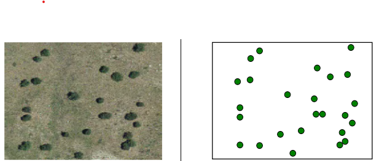

---
jupyter:
  jupytext:
    text_representation:
      extension: .md
      format_name: markdown
      format_version: '1.3'
      jupytext_version: 1.17.1
  kernelspec:
    display_name: Python 3 (ipykernel)
    language: python
    name: python3
---

# Cómo trabajar con datos vectoriales

<!-- #region jupyter={"source_hidden": true} -->
Ciertas propiedades físicas de interés para los Sistemas de Informacion Geográfica (SIG) (en inglés, _Geographical Information System, GIS_), no se capturan convenientemente mediante datos ráster en cuadrículas discretas. Por ejemplo, las características geométricas de un paisaje, como carreteras, ríos y límites entre regiones, se describen mejor utilizando líneas o curvas en un sistema de coordenadas proyectado de manera adecuada. En el contexto de los GIS, los _datos vectoriales_ son representaciones geométricas de estos aspectos del paisaje.
<!-- #endregion -->

---

## Cómo comprender de los Datos Vectoriales

<!-- #region jupyter={"source_hidden": true} -->
Los _datos vectoriales_ consisten en secuencias ordenadas de _vértices_, es decir, pares de números de la forma $(x,y)$. Las coordenadas continuas de cada vértice se asocian a una ubicación espacial física en algún Sistema de Referencia de Coordenadas (SRC) (en inglés, _Coordinate Reference System, CRS_) proyectado.

- _Puntos_: Los vértices aislados representan funciones discretas de dimensión cero (por ejemplo, árboles, faroles, etc.).
- _Líneas_ o _polilíneas_: Cualquier secuencia ordenada de por lo menos dos vértices constituye una _polilínea_ que puede visualizarse trazando líneas rectas entre vértices adyacentes. Las líneas o polilíneas son adecuadas para representar características unidimensionales como carreteras, caminos y ríos.
- _Polígonos_: Cualquier secuencia ordenada de por lo menos tres vértices en la que el primero y el último coinciden constituye un _polígono_ (es decir, una forma cerrada). Los polígonos son adecuados para representar regiones bidimensionales como un lago o el límite de un bosque. Un uso común de los polígonos  es representar las fronteras entre circunscripciones políticas (por ejemplo, países).

Un conjunto único de datos vectoriales georreferenciados con un CRS en particular, generalmente contiene cualquier número de puntos, líneas o polígonos.
<!-- #endregion -->

<!-- #region jupyter={"source_hidden": true} -->


<p style="text-align: center;">Esta imagen muestra los tres tipos de datos vectoriales: puntos, líneas y polígonos. Fuente: *National Ecological Observatory Network* (NEON) (en español, Red Nacional de Observatorios Ecológicos).
</p>
<!-- #endregion -->

<!-- #region jupyter={"source_hidden": true} -->


<p style="text-align: center;">(Imágen de la izquierda) Vista aérea de un paisaje, (imágen de la derecha) representaciones vectoriales de puntos de características destacadas.<br> Fuente: *Sistemas de Información Geográfica* por Victor Olaya.
</p>


<p style="text-align: center;">(Imágen de la izquierda) Vista aérea de un río, (imágen de la derecha) representación vectorial de líneas del río.<br>Fuente: *Sistemas de Información Geográfica* por Victor Olaya.
</p>


<p style="text-align: center;">(Imagen de la izquierda) Vista aérea de un lago, (imagen de la derecha) representación vectorial poligonal del lago.<br> Fuente: *Sistemas de Información Geográfica* por Victor Olaya.
</p>
<!-- #endregion -->

<!-- #region jupyter={"source_hidden": true} -->
Como ocurre con los datos ráster, generalmente las representaciones de datos vectoriales van acompañadas de metadatos para almacenar diversos atributos asociados al conjunto de datos. Los datos vectoriales usualmente se especifican con un nivel de precisión superior a la resolución que permiten la mayoría de las cuadrículas ráster. Además, las características geográficas representadas como datos vectoriales permiten efectuar cálculos que los datos ráster no permiten. Por ejemplo, es posible determinar diversas relaciones geométricas o topológicas:

- ¿Un punto se encuentra dentro de los límites de una región geográfica?
- ¿Dos carreteras se intersecan?
- ¿Cuál es el punto más cercano de una carretera a otra región?

Otras magnitudes geométricas, como la longitud de un río o la superficie de un lago, se obtienen aplicando técnicas de geometría computacional a representaciones de datos vectoriales.
<!-- #endregion -->

---

## Uso de GeoJSON

<!-- #region jupyter={"source_hidden": true} -->
[GeoJSON](https://geojson.org/) es un subconjunto de [notación de objeto de JavaScript, (JSON, por las siglas en inglés de _JavaScript object notation_)](https://www.json.org). Fue desarrollado a principios de la década del 2000 para representar características geográficas simples junto con atributos no espaciales. El objetivo principal es ofrecer una especificación para la codificación de datos geoespaciales que sean decodificables por cualquier decodificador JSON.

Los desarrolladores SIG responsables por GeoJSON lo diseñaron con la intención de que cualquier desarrollador web pudiera escribir un _parser_ GeoJSON personalizado, lo que permitiría muchas formas posibles de utilizar los datos geoespaciales más allá del software GIS estándar. Los detalles técnicos del formato GeoJSON se describen en el documento de estándares [RFC7946](https://datatracker.ietf.org/doc/html/rfc7946).

Veamos cómo analizar y graficar archivos GeoJSON utilizando la librería [GeoPandas](https://geopandas.org/en/stable/). El archivo local `cables.geojson` almacena datos vectoriales de líneas que representan cables submarinos conectando diferentes masas de tierra.
<!-- #endregion -->

```python jupyter={source_hidden: true}
import geopandas as gpd
from pathlib import Path
from warnings import filterwarnings
filterwarnings('ignore')

FILE_STEM = Path.cwd().parent.parent if 'book' == Path.cwd().parent.parent.stem else 'book'
GEOJSON = FILE_STEM / 'assets' / 'data' /'cables.geojson'
```

```python jupyter={source_hidden: true}
with open(GEOJSON) as f:
    text = f.read()
print(text[:1500])
```

<!-- #region jupyter={"source_hidden": true} -->
Intentar leer la salida GeoJSON anterior es complicado pero predecible. Los archivos JSON están pensados para ser consumidos por máquinas y, por tanto, no son muy legibles. Los archivos JSON están pensados genéricamente para ser consumidos por máquinas y, por lo tanto, no son muy legibles.

Utilicemos la función `geopandas.read_file` para cargar los datos vectoriales en un `GeoDataFrame`.
<!-- #endregion -->

```python jupyter={source_hidden: true}
gdf = gpd.read_file(GEOJSON)
display(gdf.head())
gdf.info()
```

<!-- #region jupyter={"source_hidden": true} -->
Hay 530 filas, cada una de las cuales corresponde a datos de línea (una secuencia conectada de segmentos de línea). Podemos utilizar el atributo `color` de la columna `GeoDataFrame` como una opción dentro de la llamada a `.plot` para graficar estos cables.
<!-- #endregion -->

```python jupyter={source_hidden: true}
gdf.geometry.plot(color=gdf.color, alpha=0.25);
```

<!-- #region jupyter={"source_hidden": true} -->
Usemos un archivo remoto para crear otro `GeoDataFrame`, esta vez que contenga datos de polígonos.
<!-- #endregion -->

```python jupyter={source_hidden: true}
URL = "http://d2ad6b4ur7yvpq.cloudfront.net/naturalearth-3.3.0/ne_110m_land.geojson"
gdf = gpd.read_file(URL)

gdf
```

<!-- #region jupyter={"source_hidden": true} -->
Esta vez, el gráfico mostrará polígonos rellenos correspondientes a los países del mundo.
<!-- #endregion -->

```python jupyter={source_hidden: true}
gdf.plot(color='green', alpha=0.25) ;
```

<!-- #region jupyter={"source_hidden": true} -->
El método `GeoDataFrame.loc` nos permite graficar subconjuntos concretos de países.
<!-- #endregion -->

```python jupyter={source_hidden: true}
gdf.loc[15:90].plot(color='green', alpha=0.25) ;
```

---

## Uso de archivos Shapefiles

<!-- #region jupyter={"source_hidden": true} -->
El estándar [_shapefile_](https://es.wikipedia.org/wiki/Shapefile) es un formato digital para distribuir datos vectoriales geoespaciales y sus atributos asociados. El estándar, desarrollado por [ESRI](https://es.wikipedia.org/wiki/Esri) hace unos 30 años, es compatible con la mayoría de las herramientas de _software_ SIG modernas. El nombre "_shapefile_" es un poco engañoso porque este tipo de archivo normalmente consiste en un conjunto de varios archivos (algunos obligatorios, otros opcionales) almacenados en un directorio común con un nombre de archivo común.

De [Wikipedia](https://es.wikipedia.org/wiki/Shapefile):

> El formato shapefile almacena la geometría como formas geométricas primitivas como puntos, líneas y polígonos. Estas formas, junto con los atributos de datos vinculados a cada una de ellas, crean la representación de los datos geográficos. El término "shapefile" es bastante común, pero el formato consiste en una colección de archivos con un prefijo de nombre de archivo común, almacenada en el mismo directorio. Los tres archivos obligatorios tienen las extensiones de archivo .shp, .shx y .dbf. El _shapefile_ real se refiere específicamente al archivo .shp, pero por sí solo está incompleto para su distribución, ya que se requieren los demás archivos de apoyo. El _software_ SIG heredado espera que el prefijo del nombre de archivo se limite a ocho caracteres para ajustarse a la convención de nombres de archivo DOS 8.3, aunque las aplicaciones de _software_ modernas aceptan archivos con nombres más largos.

Los _shapefiles_ utilizan el formato [_Binario Bien Conocido_ (WKB, por las siglas en inglés de, _Well-known Binary_)(https://libgeos.org/specifications/wkb/) para codificar las geometrías. Se trata de un formato tabular compacto, es decir, los números de la fila y la columna asumen un valor significativo. Algunas limitaciones menores de este formato incluyen la restricción de los nombres en los campos de los atributos a 10 caracteres o menos y la escasa compatibilidad con Unicode. Como resultado, el texto suele abreviarse y codificarse en ASCII.

Puedes consultar el [Informe técnico sobre  _Shapefile_ de ESRI](https://www.esri.com/content/dam/esrisites/sitecore-archive/Files/Pdfs/library/whitepapers/pdfs/shapefile.pdf) para obtener más información sobre los _shapefiles_.
<!-- #endregion -->

#### Archivos obligatorios

<!-- #region jupyter={"source_hidden": true} -->
- Archivo principal (`.shp`): formato shape, por ejemplo, los datos vectoriales espaciales (puntos, líneas y polígonos) que representan la geometría del objeto.
- Archivo de índice (`.shx`): posiciones de índice de formas (para permitir la recuperación de la geometría de los atributos).
- Archivo dBASE (`.dbf`): archivo de base de datos estándar que almacena el formato de atributos (atributos en columnas para cada tipo en formato dBase IV, normalmente legible por, por ejemplo, Microsoft Access o Excel).

Los registros corresponden en secuencia en cada uno de estos archivos, es decir, los atributos del registro $k$ del archivo `dbf` describen la característica del registro $k$ del archivo `shp` asociado.
<!-- #endregion -->

#### Archivos opcionales

<!-- #region jupyter={"source_hidden": true} -->
- Archivo de proyección (`.prj`): descripción del sistema de referencia de coordenadas correspondiente utilizando una [Representación en texto bien conocido de los sistemas de referencia de coordenadas _Well-known text representation of coordinate reference systems_ (WKT o WKT-CRS) (en español, representación en texto conocido de los sistemas de referencia de coordenadas )](https://en.wikipedia.org/wiki/Well-known_text_representation_of_coordinate_reference_systems).
- Archivo _Extensible Markup Language_ (en español, lenguaje de marcado extensible) (`.xml`): [metadatos geoespaciales](https://en.wikipedia.org/wiki/Geospatial_metadata) en formato [XML](https://es.wikipedia.org/wiki/Extensible_Markup_Language).
- Archivo de página de códigos (`.cpg`): archivos de texto sin formato para describir la codificación aplicada para crear el _shapefile_. Si tu _shapefile_ no tiene un archivo `.cpg`, entonces utiliza la codificación predeterminada del sistema.
- Archivos de índice espacial (`.sbn` y `.sbx`): archivos de índice codificados para acelerar los tiempos de carga.

Hay muchos archivos opcionales más. Consulta el [libro blanco](https://www.esri.com/content/dam/esrisites/sitecore-archive/Files/Pdfs/library/whitepapers/pdfs/shapefile.pdf) (en inglés, _whitepaper_).

Al igual que los archivos GeoJSON, _los shapefiles_ se pueden leer directamente utilizando `geopandas.read_file` para cargar el archivo `.shp`. Lo haremos ahora utilizando un _shapefile_ de ejemplo que muestra la delimitación del área de un incendio forestal.
<!-- #endregion -->

```python jupyter={source_hidden: true}
SHAPEFILE = FILE_STEM / 'assets' / 'data' / 'shapefiles' / 'mckinney' / 'McKinney_NIFC.shp'
gdf = gpd.read_file(SHAPEFILE)
gdf.info()
gdf.head()
```

```python jupyter={source_hidden: true}
gdf.plot(color='red', alpha=0.5);
```

<!-- #region jupyter={"source_hidden": true} -->
Volveremos a utilizar este _shapefile_ en cuadernos computacioales posteriores y explicaremos con más detalle lo que representa.
<!-- #endregion -->

---
