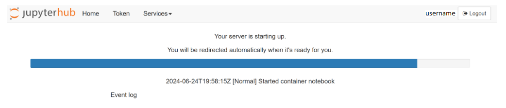
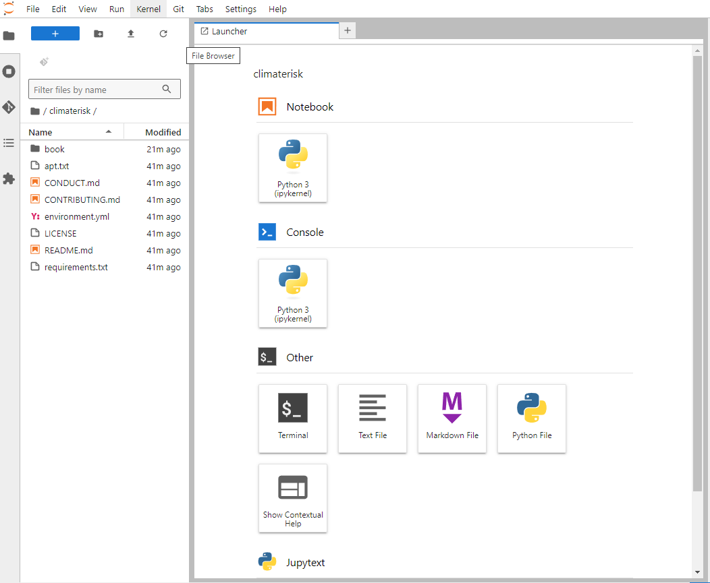
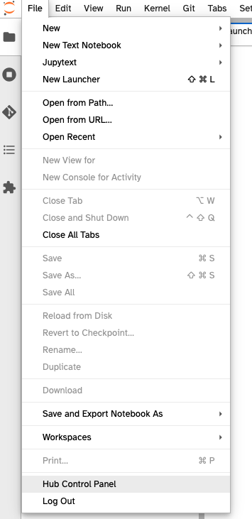

---
jupyter:
  jupytext:
    text_representation:
      extension: .md
      format_name: markdown
      format_version: '1.3'
      jupytext_version: 1.17.1
  kernelspec:
    display_name: Python 3 (ipykernel)
    language: python
    name: python3
---

# Uso del Hub de 2i2c

<!-- #region jupyter={"source_hidden": true} -->
Este cuaderno computacional contiene las instrucciones para iniciar sesión en la nube con ([JupyterHub](https://jupyter.org/hub)) plataforma proporcionada por [2i2c](https://2i2c.org) para este tutorial.

**No podrás completar este paso hasta el día que inicie el tutorial (ese día recibirás la contraseña).**
<!-- #endregion -->

## Iniciar sesión en el Hub de 2i2c

<!-- #region jupyter={"source_hidden": true} -->
Para iniciar sesión en el JupyterHub proporcionado por 2i2c, sigue estos pasos:
<!-- #endregion -->

<!-- #region jupyter={"source_hidden": true} -->
1. **Navega hasta el Hub de 2i2c:** Tu navegador web debe apuntar a [este enlace] (https://climaterisk.opensci.2i2c.cloud).

2. **Inicia sesión con tus credenciales:**

- **Nombre de usuario:** Puedes elegir cualquier nombre de usuario que desees.  Sugerimos que utilices tu nombre de usuario de GitHub para evitar conflictos.
- **Contraseña:** _Recibirás la contraseña el día que inicie el tutorial_.

 (2i2c_inicio_de_sesión)

3. **Inicio de sesión:**

El proceso de inicio de sesión puede tardar unos minutos, especialmente si es necesario crear un nuevo espacio de trabajo virtual solo para ti.
<!-- #endregion -->

<!-- #region jupyter={"source_hidden": true} -->

<!-- #endregion -->

- **Qué esperar:**

<!-- #region jupyter={"source_hidden": true} -->
De manera predeterminada, al iniciar sesión en [`https://climaterisk.opensci.2i2c.cloud`](https://climaterisk.opensci.2i2c.cloud) se clonará automáticamente un repositorio para trabajar. Si el inicio de sesión es exitoso, verás la siguiente pantalla y estarás listo para empezar a trabajar.

**Notas:** Cualquier archivo en el que trabajes se mantendrá entre sesiones siempre y cuando uses el mismo nombre de usuario al iniciar sesión.
<!-- #endregion -->

<!-- #region jupyter={"source_hidden": false} -->
---
<!-- #endregion -->

## Apagando el Hub de 2i2c

<!-- #region jupyter={"source_hidden": true} -->
Para apagar el JupyterHub proporcionado por 2i2c, siga estos pasos:

+ Guardar y apagar todos los cuadernos de Jupyter (el menú *Sessions and Tabs* puede apagar todos los kernels a la vez).
+ En el menú *File*, seleccione *Hub Control Panel* (ubicado cerca de la parte inferior del menú). &nbsp;
+ Cuando el panel de control del hub se cargue en una nueva pestaña del navegador, haga clic en el botón rojo.&nbsp; 
<!-- #endregion -->

<!-- #region jupyter={"source_hidden": false} -->
---
<!-- #endregion -->
